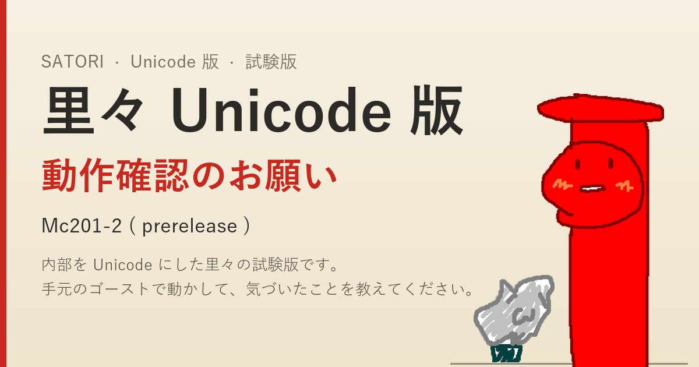

# 里々 Unicode 版 試験版 ─ 動作確認のお願い

<div class="s2-hero" markdown>



</div>

<div class="s2-lead" markdown>

**里々の内部を Unicode にした試験版（Mc201-2）を公開しました。**

辞書に絵文字や Shift_JIS にない文字を書けるようになり、UTF-8 の辞書も読めます。その一方で、20 年以上使われてきた仕組みの土台を入れ替えたので、**作者ひとりの手元では確かめきれていない部分が確実に残っています。**

そこで、手元のゴーストで動かして、従来の里々との違いや不具合を見つけていただけないでしょうか。このページは、そのお願いの文書です。

</div>

<div class="s2-cta" markdown>

[試験版をダウンロード（GitHub Releases）](https://github.com/ukatech/satoriya-shiori/releases/tag/Mc201-2) [不具合・気づいた点の報告（Issues）](https://github.com/ukatech/satoriya-shiori/issues) [ACP 版との違い](unicode-changes.md)

</div>

!!! warning "導入前に：元の版（Mc1XX）には戻せません"
    この版で一度起動すると、セーブデータは **UTF-8 で保存**されます。従来の版（Mc172-3 など）は UTF-8 のセーブデータを正しく読めないため、元の版に戻すと変数が化けたり失われたりします。UTF-8 で書いた辞書も、従来の版では読めません。

    **必ず、セーブデータ（`satori_savedata.txt` と `satori_savebackup.txt`。暗号化していれば `.sat`）と、ゴースト全体のバックアップを取ってから**試してください。従来の版の Shift_JIS のセーブデータや辞書は、この版でそのまま読めます。

## 何が変わったのか

これまでの里々（ACP 版、`Mc1XX`）は、文字を Shift_JIS のバイト列として扱っていました。この版（`Mc2XX`）は、内部のすべての文字列を Unicode にしています。

| | ACP 版（Mc1XX） | Unicode 版（Mc2XX） |
|---|---|---|
| 使える文字 | Shift_JIS にある文字 | 絵文字・補助面の文字・「髙」など、Unicode の文字（サロゲートペアは 1 文字として数える） |
| 辞書の文字コード | Shift_JIS | Shift_JIS または UTF-8（自動判定） |
| ベースウェアとの通信 | Shift_JIS | リクエストの `Charset` に合わせる（SSP とは UTF-8） |
| SAORI・SSTP・ssu | ACP | UTF-8 |
| 文字数を使う処理 | Shift_JIS のバイト数 | 文字数 |
| セーブデータ | Shift_JIS | UTF-8（読み込みは自動判定） |

「バイト数から文字数に変わった」ことは、目に見える動作の違いを生みます。たとえば自動挿入ウェイトは、全角 1 文字を 1 として数えるようになったので、日本語では従来のおよそ半分になります。ほかにも `calc` での文字列の長さ比較、コミュニケートの点数、`（バイト値,n）` などが変わりました。一覧は[ACP 版との違い](unicode-changes.md)にあります。

## 作者側で確かめたこと・確かめきれていないこと

正直に書いておきます。

**確かめたこと**

- 従来版と Unicode 版の `satori.dll` に同じ Shift_JIS の辞書とリクエストを与えて、応答を比較した（自動ウェイトの値と、直した不具合の分を除いて一致）
- 里々 Wiki の記述例のうち複雑そうなものを集めて、通ることを確かめた（スモークテスト）
- SSP で実際にゴーストを起動して、SSTP でイベントを送り、UTF-8 で通信できること、絵文字入りのコミュニケートに応答できることを確かめた
- 外部の SAORI（2 種類）を UTF-8 で呼べることを確かめた
- セーブデータの保存と再読み込み（Shift_JIS の旧セーブの読み込み、UTF-8 での保存、暗号化 `.sat`）を確かめた
- このマニュアルを書くために、ssu の全関数と `（）` 内蔵関数、システム変数の大半を実機で動かした

**確かめきれていないこと**

- 世の中にある多様なゴースト、辞書の書き方、SAORI との組み合わせ（ここがいちばん足りません）
- 文字コードの古い作法に頼った辞書や SAORI（Charset ヘッダを無視して常に Shift_JIS で解釈する呼び出し側など）
- さとりすとの連携（`SatolistEcho` の応答を UTF-8 にしましたが、受け側の対応は未確認）
- ログ受信ツール（れしば・tama）との連携
- 長時間の運用（自動セーブ、タイマ、ランダムトークなど）
- Windows 以外のビルド（POSIX・Emscripten）は、構文チェックしかしていません

## お願いしたいこと

### 1. とにかく動かしてみる

1. ゴースト全体と、セーブデータのバックアップを取る。
2. [Releases](https://github.com/ukatech/satoriya-shiori/releases/tag/Mc201-2) の `satori.zip` から `satori.dll` を取り出し、ゴーストの `master` フォルダの `satori.dll` と差し替える。
3. いつもどおりゴーストを起動して、しばらく使ってみる。
4. 動作に違和感があれば、下の観点を参考に、報告してください。何も起きなければ、それもうれしい報告です（「このゴーストで数日動かして問題なし」の一言で助かります）。

バージョンは `（里々のバージョン）` で確認できます（`phase Mc201-2` と出ます）。

### 2. 特に見ていただきたい観点

| 観点 | 見てほしいこと |
|------|----------------|
| **自動ウェイト** | 喋る速さが変わったと感じないか。半分になるのは仕様ですが、`＄自動挿入ウェイトの倍率` の調整で戻せるか |
| **SAORI との連携** | 外部の SAORI が、これまでどおり呼べるか。文字化けしないか。SAORI 側が UTF-8 を想定していない場合の症状 |
| **辞書の文字コード** | Shift_JIS・UTF-8（BOM あり・なし）の辞書が混在していても読めるか。「①」「髙」「～」「〜」など、コードが複数ある文字の扱い |
| **セーブデータ** | 終了・再起動をくり返しても変数が保たれるか。暗号化セーブを使っている場合の動作 |
| **文字数に依存する処理** | `length` `substr` `calc` の文字列比較、`sprintf` の幅、コミュニケートの反応が、従来と食い違わないか |
| **コミュニケート・NOTIFY 連携** | 他のゴーストとの会話、`使ってるぞグラフ`、導入済みリソースの確認 |
| **ログ・デバッグ** | れしば・tama・さとりすとを使っている場合、表示が正しいか |
| **その他** | 従来の里々と結果が違うもの、エラーになるようになったもの、仕様書と実際の動きが食い違うもの |

### 3. 仕様の突き合わせ

このマニュアル（[satori-docs](https://ukatech.github.io/satori-docs/)）は、里々のソースコードを読み、実機で確かめながら書き起こした**仕様書**です。里々 Wiki とは別に、ソースから読み取れる動作だけを書いています。

Wiki や、長く使ってこられた方の記憶にある動作と、この仕様書の記述が**食い違うところ**があれば、教えてください。どちらが正しいかはそのときに一緒に考えます（ソースを直す場合も、仕様書を直す場合もあります）。

書き起こす過程で見つけた、次のような挙動は、意図どおりなのか判断がつかなかったものです。ご意見をください。

- 文の最初に喋るキャラクターは、本体側（`\0`）ではなく**相方側（`\1`）**で、最初の `：` で本体側になる
- `（文の名前）` で呼び出した文は、先頭が `\1` で始まり、呼び出し先の最後のキャラクターが元の文に引き継がれる
- `satori_conf.txt` に書いた文と単語群は、`＊初期化` と `＠SAORI` を除いて、読み込みの途中で破棄される（そのため、重複回避の設定を `＊初期化` に書いても効かない）
- 数字で始まる引数は、SAORI（ssu を含む）に渡す前に、里々が整数の式として計算する（`＄SAORI引数の計算` の既定は「自動」）
- `while` には繰り返し回数の上限がない
- 同名の文と単語群があるとき、`（名前）` は単語群を優先する

## 報告のしかた

[Issues](https://github.com/ukatech/satoriya-shiori/issues) に、次のような内容を書いていただけると、原因を追いやすくなります。「なんとなくおかしい」だけでも構いません。

```
■ バージョン
（里々のバージョン）の結果: phase Mc201-2
OS: Windows 11
ベースウェア: SSP 2.x.x
ゴースト: （名前。配布されているもの・自作・その他）

■ 起きたこと
（例）自動ウェイトが短くなって、会話がせわしなくなった

■ 従来の版ではどうだったか
（例）Mc172-3 では、この文は \_w[24] だった

■ 再現の手がかり
（例）dic_talk.txt のこの文で起きる（辞書の該当部分）
（可能なら）ShioriEcho での結果、ログ（れしば・tama）の内容
```

再現の確認には、次の方法が使えます。

- **ShioriEcho:** `satori_conf.txt` の `＊初期化` に `＄デバッグ＝有効` と書くと、里々の文を 1 行ずつ展開して結果を返せます（[ShioriEcho とデバッグ](../shiori/debug.md)）
- **ハーネス:** `satori.dll` を SSP なしで直接呼ぶ小さなプログラムが、リポジトリの [`satoriya/test/harness`](https://github.com/ukatech/satoriya-shiori/tree/unicode/satoriya/test/harness) にあります
- **tama:** 辞書のエラーは、ログ受信ツール [tama](https://github.com/YAYA-shiori/tama/releases) で確認できます

## 動作確認のはじめの一歩に

里々の配布物には、もともとサンプルゴースト「ポストと狛犬」が付属していました。小さなゴーストなので、試験版を差し替えて動かす最初の確認に向いています。

<div class="s2-chars" markdown>


{ .s2-komainu }

「ポストと狛犬」（櫛ヶ浜やぎ）。ポストはお便りを受けとって、狛犬は番をする。試験版にも、その両方がほしいところです。

</div>

## もとに戻したくなったら

1. ゴーストを終了する。
2. `satori.dll` を、バックアップした従来の版に戻す。
3. `satori_savedata.txt` と `satori_savebackup.txt` を、バックアップから戻す。

3 を忘れて従来の版で起動すると、UTF-8 のセーブデータが読めずに、変数が失われます。

## 関連

- [ACP 版との違い](unicode-changes.md)
- [文字コード](../grammar/14-charset.md)
- [エラーメッセージ・警告](error-messages.md)
- [里々とは](../startup/what-is-satori.md)

<div class="s2-byline" markdown>

---

このページの文・図: **[Claudia](https://ponadocs.shillest.net/claudia/)**

</div>
